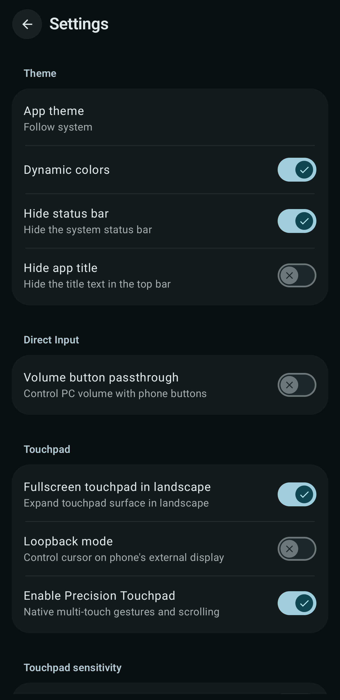
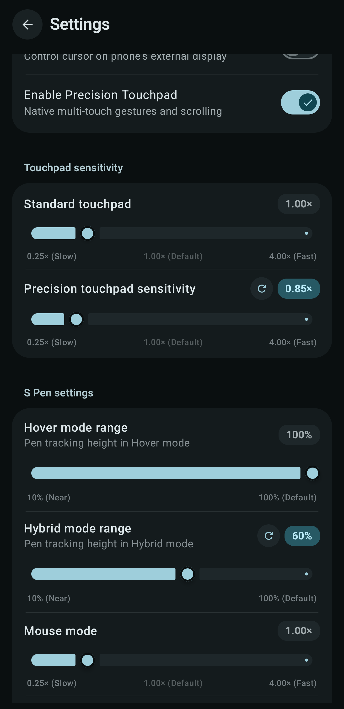
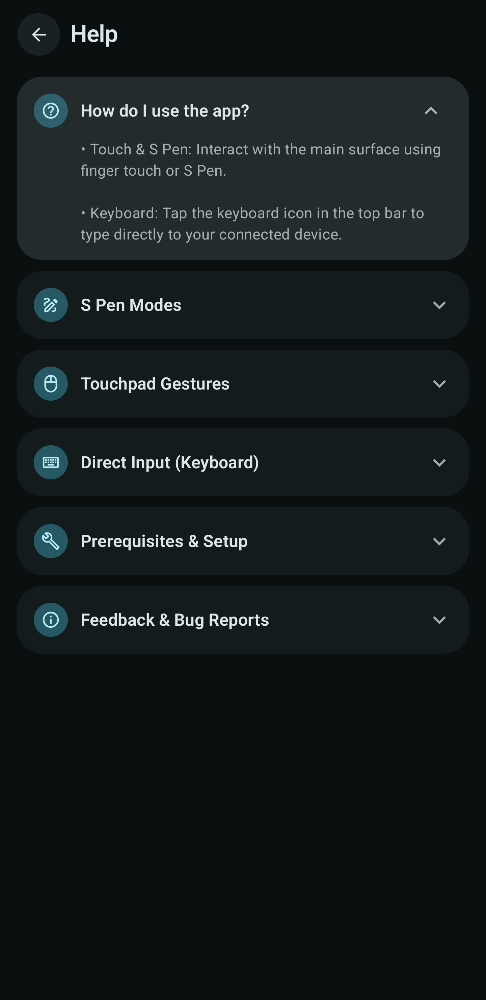

# Android S Pen HID Client

Use a rooted Android phone as a USB keyboard, mouse, Windows Precision Touchpad, or S Pen input device. The host computer sees standard USB HID devices, so it does not need a companion program.

This is a fork of [Arian04/android-hid-client](https://github.com/Arian04/android-hid-client). The original project supplies the USB keyboard, mouse, ConfigFS gadget management, and root integration that this work builds on.

## Screenshots

<p align="center">
  
  
  
  
</p>

<p align="center">
  
  <br>
  <em>Fullscreen drawing tablet / touchpad canvas in landscape orientation with floating keyboard access</em>
</p>

## Downloads

Download the latest signed release APK from [GitHub Releases](https://github.com/dotcomdomain/android-spen-hid-client/releases/latest).

## What changed in this fork

### S Pen input

The main input area accepts finger and stylus input without a manual input switch. S Pen input has three modes:

| Mode | Behavior |
| --- | --- |
| Hover | Maps the pen's absolute position to the host screen. Touching presses the left mouse button. |
| Mouse | Moves the pointer like a trackpad while the pen touches the phone. A tap clicks. Double tap and hold starts a left button drag. |
| Hybrid | Moves the pointer relative to its previous position while the pen is in digitizer range. Touching holds the left mouse button. |

The S Pen side button sends the right mouse button. Holding it while hovering opens a radial mode selector. Hover and Hybrid modes have separate range controls, while Mouse and Hybrid modes have separate sensitivity controls.

The USB report descriptor includes a separate absolute mouse collection for Hover mode.

### Windows Precision Touchpad

The finger input area can expose a native multitouch Precision Touchpad to Windows. This fork adds:

- a Windows compatible Precision Touchpad report descriptor
- complete multitouch frames with contact IDs, counts, scan times, and explicit lift reports
- one finger left click and two finger right click behavior handled by Windows
- coordinate mapping that keeps touch speed equal in portrait and landscape
- a larger square HID coordinate range so the whole landscape input area remains usable
- separate sensitivity controls for standard and precision touchpad modes

Linux and other hosts can still use the HID touchpad. Precision gestures depend on the host operating system.

### USB gadget support

Samsung's Exynos USB stack does not manage ConfigFS exactly like AOSP. This fork adds handling for Samsung's USB function selector, preserves ADB while rebuilding the gadget, waits for gadget operations to finish, and avoids duplicate HID entries on later rebuilds.

The app reports missing kernel HID support instead of presenting a generic disconnected-device error.

### Interface and controls

- Material 3 interface throughout the app
- fullscreen touchpad option in landscape
- optional hidden status bar and app title
- floating keyboard control in fullscreen landscape
- updated onboarding, help, diagnostics, settings, and manual input screens
- configurable sensitivity for both touchpad modes and the relative S Pen modes
- separate Hover and Hybrid tracking ranges

## Requirements

- Android 8.0 or newer
- root through Magisk or KernelSU
- USB device mode and ConfigFS support
- the kernel option `CONFIG_USB_CONFIGFS_F_HID=y` or equivalent built in HID gadget support
- permission to create and write `/dev/hidg*` devices

Root access alone cannot add a missing HID gadget driver. A stock kernel that omits the driver needs a compatible custom kernel.

The current development device is a Samsung Galaxy Note9, model SM-N960F, running Android 16 and kernel 4.9.337. Other rooted devices should work when their kernel and USB controller provide the requirements above. Stylus behavior depends on Android exposing hover, distance, and button events through `MotionEvent`.

## Build

### Android Studio

1. Clone the repository.
2. Open it in a current Android Studio version with JDK 21 and Android SDK 36 installed.
3. Build the `debug` or `release` APK from Android Studio.
4. Install the APK on the rooted Android device.

The package name is `com.dotcomdomain.android_spen_hid_client`, allowing standalone installation alongside the original upstream app.

### Termux on arm64

Install JDK 21, Clang, and Android SDK platform and build tools 36. Then run:

```sh
./scripts/build-termux.sh
```

The script builds the native library with Termux Clang and passes the Termux `aapt2` binary to Gradle. The resulting APK is written to:

```text
app/build/outputs/apk/debug/app-debug.apk
```

## First run

1. Grant root access.
2. Let the app create its keyboard and pointer HID functions.
3. Reconnect USB if the host does not immediately enumerate the new interfaces.
4. Enable Precision Touchpad in Settings when using Windows gestures.

Changing the HID report descriptor requires the USB gadget to disconnect and enumerate again. Wired ADB will briefly disconnect during that operation.

## General device compatibility

Keyboard and standard mouse output are the most portable features. Precision Touchpad support uses standard HID reports but requires a host that understands the protocol. S Pen support also works with another active stylus if its Android driver reports stylus hover, contact, distance, and side button events.

Manufacturer USB services may replace custom gadget functions after a cable reconnect or reboot. The Samsung specific path in this fork handles the behavior found on the Exynos 9810 Note9. Other vendor implementations may need their own adapter.

## Upstream and license

Original project: [Arian04/android-hid-client](https://github.com/Arian04/android-hid-client)

This fork keeps the upstream Git history and is distributed under the [GNU General Public License v3.0](LICENSE).
